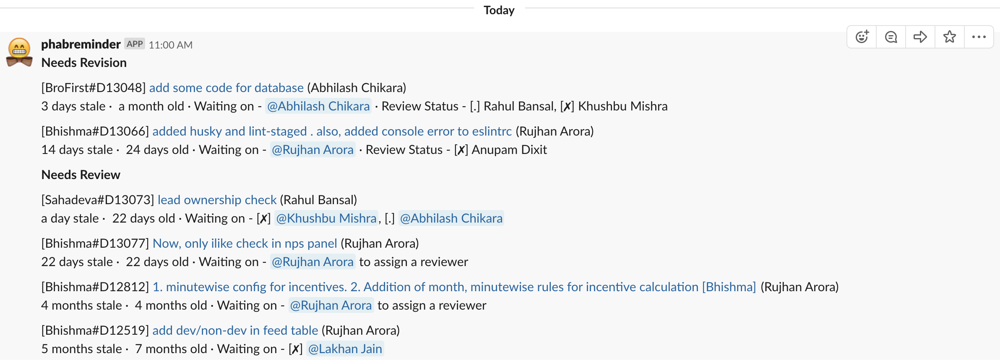

# knock-knock
> knock-knock is a slack bot for phabricator

## Table of contents
* [General info](#general-info)
* [Screenshots](#screenshots)
* [Technologies](#technologies)
* [Setup](#setup)
* [Features](#features)
* [Status](#status)
* [Inspiration](#inspiration)
* [Contact](#contact)

## General info
> knock-knock is for teams using phabricator as a code repository, code review tool and slack as the istant messaging app for intra team communication. It is a productivity tool that enables teams to reduce code review turn around times by reminding them about pending revisions in a slack channel and as a private message via slackbot

## Screenshots


## Technologies
* [Node.js](https://nodejs.org)
* [@slack/webhook](https://slack.dev/node-slack-sdk/webhook)

## Setup
* Clone the repository
* Get a slack webhook and a phabricator conduit token
* Setup the .env file
* Setup the configuration file
* Setup ./src/app.js as a service (node express api server)
* Setup a crontab to periodically hit the APIs for required features

## Features
List of features ready and TODOs for future development
* Send Differential reminders via a simple GET request to /v1/sendPhabDifferentialReminder
    * A message will be sent (the one in the screenshot) to the configured slack channel
    * A message will also be sent via slackbot for a filtered message (based on "waiting on" developer)
    * Message Format:
        ```
        [androidApp#D13073] Updates in chat library (Rahul Bansal)
        14 days stale ·  22 days old · Waiting on - [✗] @Khushbu Mishra, [.] @Abhilash Chikara
        ```
        ```
        [<Repository Name>#<Differential ID>] <Differential title> (Differential Author)
        <Number of days since last update>  ·  <Number of days since creation> ·  Waiting on - <Symbol for review Status> <Slack Mention String>
        ```


To-do list:
* Send personal slack messages on phabricator events like:
    * Differential rejected
    * Differential accpeted
    * Requested review on a differential
* Use a dedicated slack bot instead of the common slackbot

## Status
Project is _in progress_ as some of the features are yet to be coded for. Having said that, the list of features not in to-do list are fully functional

## Inspiration
[Pull Reminders](https://pullreminders.com/) app for github PRs

## Contact
Created by [Mohit Jindal](https://www.linkedin.com/in/mjindal23/) - feel free to contact me!